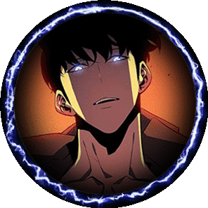

  

 

  

  <h3>Connect with me:</h3>
  

    
    
    
    
  

---

<h3 align="center">🔮 My Shadow Army 🔮</h3>

<em>(Languages and Tools I Command)</em>

  

---

<h3 align="center">📈 Analyzing the Flow of Mana 📈</h3>

<em>(My GitHub Stats)</em>

  
    
  
    
  

---

 
<h3 align="center">✨ My Legendary Skills ✨</h3>

<em>(My Pinned Projects)</em>

  
   
     
  

 

  —╲╳╱—

 

  <em>"If this world continues to reject me, then I shall reject the world."</em>
   
  <strong>- Zeref Dragneel</strong>

   

  <pre>—╲╳╱—</pre>

